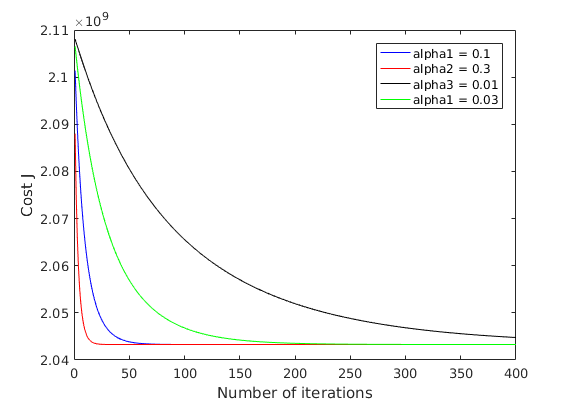
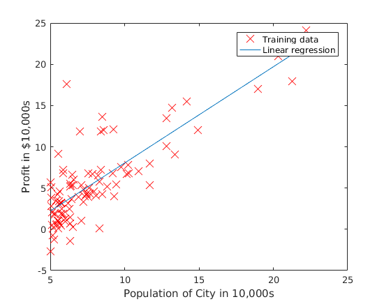
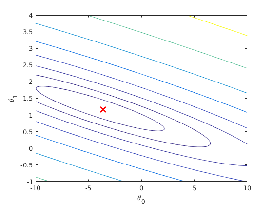
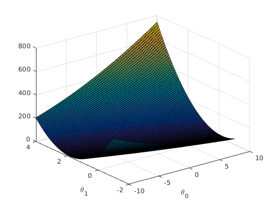

# MachineLearning

## Linear Regression
Linear Regression in multiple variables with
> Gradient Descent Algorithm  
> Normal Equation Method

### Multivariate

Loading data ...  
First 10 examples from the dataset:   
 x = [2104 3], y = 399900   
 x = [1600 3], y = 329900   
 x = [2400 3], y = 369000   
 x = [1416 2], y = 232000   
 x = [3000 4], y = 539900   
 x = [1985 4], y = 299900   
 x = [1534 3], y = 314900   
 x = [1427 3], y = 198999   
 x = [1380 3], y = 212000   
 x = [1494 3], y = 242500   
Program paused. Press enter to continue.  

Normalizing Features ...  
Running gradient descent ...  
Theta computed from gradient descent:   
 334302.063993   
 100087.116006   
 3673.548451   

Predicted price of a 1650 sq-ft, 3 br house (using gradient descent):  
 $289314.620338  
Program paused. Press enter to continue.  

Solving with normal equations...  
Theta computed from the normal equations:   
 89597.909544   
 139.210674   
 -8738.019113   

Predicted price of a 1650 sq-ft, 3 br house (using normal equations):  
 $293081.464335  

### Unvariate

Plotting Data ...
Program paused. Press enter to continue.

Running Gradient Descent ...

ans =

   32.0727

Theta found by gradient descent:
-3.630291
1.166362 

For population = 35,000, we predict a profit of
4519.767868

For population = 70,000, we predict a profit of
45342.450129

Program paused. Press enter to continue.

Visualizing J(theta_0, theta_1) ...

###TODO
- Remove scafolding